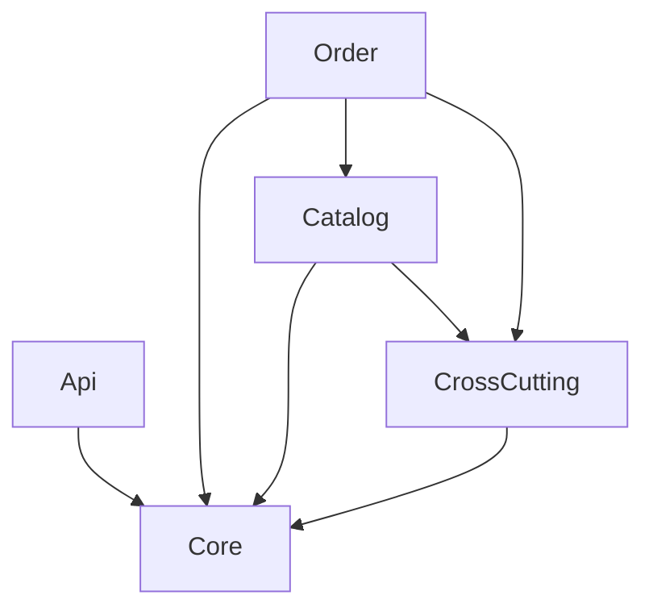

# Estrutura
{: .no_toc }

## Conteúdo
{: .no_toc .text-delta }

1. TOC
{:toc}

---

### Introdução
A estrutura de um projeto é um dos pontos mais importantes para a manutenção e escalabilidade do mesmo. A seguir, serão apresentadas as boas práticas para a estruturação de um projeto em .NET.

---

### Entenda o produto
Antes de começar a estruturar o projeto, é importante entender o produto que será desenvolvido. Qual é o problema que você está resolvendo? Quem são os usuários? Quais são os requisitos? Quais são as funcionalidades? Quais são as tecnologias que serão utilizadas? Essas são algumas perguntas que devem ser respondidas antes de começar a estruturar o projeto.

---

### Desenhando a estrutura
Agora que você sabe o que será desenvolvido, é hora de desenhar a estrutura do projeto. Aqui é muito importante que esteja claro para você qual é o core do projeto e quais são os módulos que serão desenvolvidos e que se comunicarão entre si.
Por padrão, criamos sempre uma pasta raíz nomeada **src** que contêm todos os módulos do projeto.
Em seguida, criamos os módulos do projeto, geralmente temos:
- **Api**: Onde ficam as controllers, middlewares, filtros, os arquivos de injecção de dependência e os arquivos de configuração.
- **Core**: Onde ficam as classes, interfaces e implementação que são compartilhadas entre os módulos.
- **CrossCutting**: Aqui ficam as implementações de chamadas a APIs externas.

Além disso, devemos entender quais são os contextos do projeto e como eles se comunicam. Por exemplo, em um projeto de e-commerce, podemos ter os seguintes contextos:
- **Catalog**: Onde ficam as classes, interfaces e implementações relacionadas ao catálogo de produtos.
- **Order**: Onde ficam as classes, interfaces e implementações relacionadas aos pedidos.

Dessa forma, a estrutura de pastas fica assim:

{: .lh-0 }
```
┌─ src
    ├─ Api
        ├─ Controllers
        ├─ Setup
        ├─ Middlewares
    ├─ Core
        ├─ DomainObjects
    ├─ CrossCutting
        ├─ Gateways        
    ├─ Catalog
        ├─ Application
            ├─ Interfaces
            ├─ Services
        ├─ Domain
            ├─ Context
            ├─ Entities
        ├─ Infra
            ├─ Factory
            ├─ Migrations
            ├─ Repositories
    ├─ Order
        ├─ Application
            ├─ Interfaces
            ├─ Services
        ├─ Domain
            ├─ Context
            ├─ Entities
        ├─ Infra
            ├─ Factory
            ├─ Migrations
            ├─ Repositories
```


E a comunicação entre os módulos ficaria assim:

